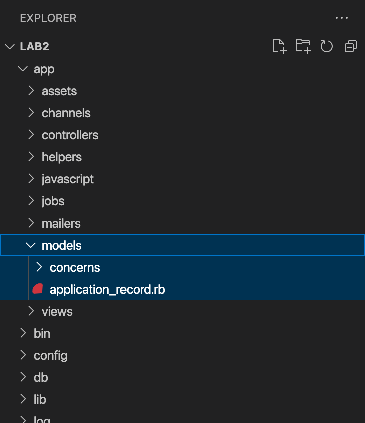

## Ingeniería de Software 2022
Laboratorio 2 - Modelos

==

MVC: <span style="color: #efa">Model</span> View Controller

==

Capas de la aplicación

## Modelo
Accesos a la DB

==

## Modelos en Rails

--

<!-- Add image to models-folder.png from assets folder -->


--

Podemos crear el archivo manualmente o usando el comando:

```bash
rails generate model tweet content:text monster:references
```

```ruby
class Tweet < ApplicationRecord
end
```

[Más sobre el comando rails generate](https://guides.rubyonrails.org/command_line.html#bin-rails-generate)

--

`ApplicationRecord` es la clase padre de todos los modelos.

Se encarga, entre otras cosas, de mapear un modelo con una tabla en la base de datos.

```ruby
class Tweet < ApplicationRecord   #=> Tabla: tweets
end

class Monster < ApplicationRecord #=> Tabla: monsters
end
```

[Más sobre ActiveRecord, la librería detrás del mapeo entre modelos y tablas](https://guides.rubyonrails.org/active_record_basics.html)

==

## Validaciones

--

```ruby
t = Tweet.new
t.save
```

<div class="fragment">

|id|content                     |monster_id |
|- |-                           |-          |
|1|¡Me voy a chupar tu sangre   |1          |
|2|¡Te voy a aplastar!          |2          |
|3|Te voy a destripar!          |3          |
|4|Feliz primavera              |4          |
|5| | |

</div>

--

```ruby
# app/models/tweet.rb

class Tweet < ApplicationRecord
  validates :content, presence: true
end
```

```ruby [2-3|4|5-6]
# rails console
t = Tweet.new
t.save
#=> false
t.errors.messages
#=> {content: ["can't be blank"]}
```

[Otras validaciones](https://guides.rubyonrails.org/active_record_validations.html#validation-helpers)

--

Los tweets publicados después de las 10 de la noche solo pueden tener 256 caracteres.

```ruby
# app/models/tweet.rb

class Tweet < ApplicationRecord
  validate :content_must_be_lesser_than_256_chars_after_10_pm

  def content_must_be_lesser_than_256_chars_after_10_pm
    if created_at.hour >= 22 && content.size > 256
      errors.add(:content, "can't be greater than 256 chars after 10 PM")
    end
  end
end
```

[Más sobre validaciones custom](https://guides.rubyonrails.org/active_record_validations.html#custom-methods)

==

## Relaciones

--

`tweets`
|id|content|monster_id |
|- |-|-|
|1|Pedí sangre añejada y me vendieron un malbec añejado|1|
|2|AAAAAAHGHHH!|2|
|3|Quien para asustar turistas?|3|
|4|Feliz primavera|4|


`monsters`
|id|name|description|
|-|-|-|
|1|Dracula|Chupa sange. Hincha del rojo. Libertario. ALA|
|2|King Kong|Gorila gigante. #VamosAVolver. BocaJrs.|
|3|Nahuelito|Vivo en el Nahuel Huapi. Soltero. Fanático del plancton|
|4|James P. Sullivan|#monstropolis #scareroftheyear|

--

```ruby
# app/models/tweet.rb

class Tweet < ApplicationRecord
  belongs_to :monster
end
```

```ruby [1-3|5-7]
t = Tweet.first
t.monster
#=> Retorna una instancia de Monster

m = Monster.first
t = Tweet.new(content: "Obvñzfhnhxds", monster: m)
#=> Inicializa un tweet asociado al monster `m`
```

Un tweet pertenece a un monstruo

--

```ruby
# app/models/monster.rb

class Monster < ApplicationRecord
  has_many :tweets
end
```

```ruby
m = Monster.first
m.tweets
#=> Retorna una colección de Tweets
```

Un monstruo tiene muchos tweets.

--

```ruby
# app/models/monster.rb

class Monster < ApplicationRecord
  has_many :tweets, dependent: :destroy
end
```

```ruby [1-3|5-7]
m = Monster.first
m.tweets
#=> [#<Tweet id: 1, ...>, #<Tweet id: 4, ...>]

m.destroy
Tweet.where(id: [1, 4])
#=> [] colección vacía, se borraron los tweets junto al monstruo
```

[Más sobre relaciones](https://guides.rubyonrails.org/association_basics.html)

==

## Migraciones

--

Permiten modificar el esquema de la base de datos.

```ruby
class CreateMonsters < ActiveRecord::Migration[7.0]
  def change
    create_table :monsters do |t|
      t.string :name
      t.text :description

      t.timestamps
    end
  end
end
```

--

¿Cómo crear una migración?

```bash
rails g migration add_details_to_tweets
```

<div class="fragment semi-fade-out">

```ruby
class AddDetailsToTweets < ActiveRecord::Migration[7.0]
end
```

</div>

<div class="fragment">

```ruby
class AddDetailsToTweets < ActiveRecord::Migration[7.0]
  def change
    # Para guardar desde donde se envió el tweet
    # (por ej: Critter for iPhone)
    add_column :tweets, :user_agent, :string

    # Para configurar si el tweet es para todos,
    # para los que sigo o a los que mencione
    add_column :tweets, :privacy_level, :integer
  end
end
```

</div>

--

¿Cómo correr las migraciones creadas?

```bash
rails db:migrate
```

¿Cómo revertir la última migración?

```bash
rails db:rollback
```

[Más sobre migraciones](https://guides.rubyonrails.org/active_record_migrations.html)

==

## Seeds

--

Sirve para agregar datos iniciales luego de crear la base de datos.

```ruby
# db/seeds.rb

5.times do |index|
  Monster.create(name: "Monstruo #{index}", description: "Soy el monstruo #{index}")
end
```

--

¿Cómo correr el archivo de seeds?

```bash
rails db:seed
```

## [Práctica](https://github.com/I110IS/lab2/blob/master/README.md)

> "Software and cathedrals are much the same; first we build them, then we pray." --Anonymous
