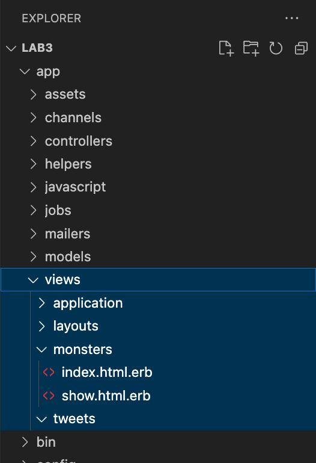

## Ingeniería de Software 2022
Laboratorio 3 - Vistas

==

MVC: Model <span style="color: #efa">View</span> Controller

==

Capas de la aplicación

## Vistas
Presentación visual de la información (usuario final)

==

## Vistas en rails

--



--

<span class="">`index.html.erb` > Template para mostrar una colección de recursos</span>

<span class="fragment">`show.html.erb` > Template para mostrar la info detallada de un recurso</span>

<span class="fragment">`new.html.erb` > Template para crear un recurso</span>

<span class="fragment">`edit.html.erb` > Template para editar un recurso</span>

--

### ERB

> ERB provides an easy to use but powerful templating system for Ruby. Using ERB, actual Ruby code can be added to any plain text document for the purposes of generating document information details and/or flow control. [Documentation](https://rubyapi.org/3.1/o/erb)

```erb
<% Ruby code -- inline with output %>
<%= Ruby expression -- replace with result %>
<%# comment -- ignored -- useful in testing %>
(<% # doesn't work. Don't use Ruby comments.)
```

==

## HTML en rails

1. Templates
1. Partials
1. Layouts

==

## Templates

```erb
<%# app/views/tweets/index.html.erb %>

<h1>Lista de tweets</h1>
<% @tweets.each do |tweet| %>
  Tweet: <%= tweet.content %>
<% end %>
```

[Templates](https://guides.rubyonrails.org/action_view_overview.html#templates)

==

## Partials

```erb
<%# app/views/tweets/new.html.erb %>

<h1>Nuevo tweet</h1>

<%= render "form", tweet: @tweet %>
```

<div class="fragment">

```erb
<%# app/views/tweets/edit.html.erb %>

<h1>Editar tweet</h1>

<%= render "form", tweet: @tweet %>
```

</div>

<div class="fragment">

```erb
<%# app/views/tweets/_form.html.erb %>

<%= form_with model: @tweet do |form| %>
  <%= form.text_field :content %>
  <%= form.submit %>
<% end %>
```

</div>

[Partials](https://guides.rubyonrails.org/action_view_overview.html#partials)

==

## Layouts

```erb
<%# app/views/layouts/application.html.erb %>

<html>
  <head><title>LAB3</title></head>
  <body>
    <%= yield %>
  </body>
</html>
```

`yield` identifica la sección donde se va a insertar un template.

[Layouts](https://guides.rubyonrails.org/action_view_overview.html#layouts)

==

## View helpers

¿Cómo insertar una imagen?

```erb
<%# La imagen debe existir en app/assets/images %>

<%= image_tag "lab3.png" %>
```

--

¿Cómo insertar un link?

```erb
<%= link_to monster.name, monster %>

<%= link_to "Inicio", monsters_path %>

<%= link_to monsters_path do %>
  <%= image_tag "home.svg" %>
<% end %>
```

[Más view helpers](https://guides.rubyonrails.org/action_view_helpers.html)

==

## Anexo

- [¿Qué es HTML?](https://developer.mozilla.org/en-US/docs/Web/HTML)
- [¿Qué es CSS?](https://developer.mozilla.org/en-US/docs/Web/CSS)
- [¿Qué es bootstrap?](https://getbootstrap.com/)

==

## [Práctica](https://github.com/I110IS/lab3/blob/master/README.md)

> "Inside every large program is a small program struggling to get out." --Tony Hoare
