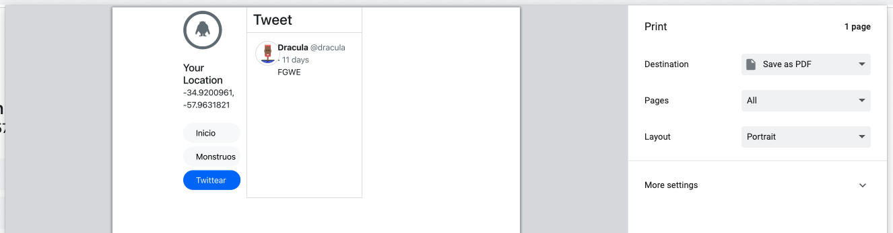

## Ingeniería de Software 2023
Laboratorio 5 - Formularios, archivos y PDFs

==

<div class="r-stack">
  
  
  
  
</div>

==

Los formularios representan una sección—de un documento HTML—que contiene controles interactivos para enviar información.

--

```html
<form action="/users" method="post">
  <div class="form-control">
    <label for="name">Ingrese su nombre: </label>
    <input type="text" name="name" id="name" required>
  </div>
  <div class="form-control">
    <label for="email">Ingrese su email: </label>
    <input type="email" name="email" id="email" required>
  </div>
  <div class="form-control">
    <input type="submit" value="Quiero suscribirme!">
  </div>
</form>
```

<%= preview_tags[:start] %>
<form action="#" method="get">
  <div class="form-control">
    <label for="name">Ingrese su nombre: </label>
    <input type="text" name="name" id="name" required>
  </div>
  <div class="form-control">
    <label for="email">Ingrese su email: </label>
    <input type="email" name="email" id="email" required>
  </div>
  <div class="form-control" style="margin-top: 5px">
    <input type="submit" value="Quiero suscribirme!">
  </div>
</form>
<%= preview_tags[:end] %>

==

A medida que agregamos más inputs, escribir y mantener el markup se convierte tedioso.

Rails nos provee algunos helper methods para generar el markup.

```erb
<%%= form_with do |form| %>
  Contenido del form acá
<%% end %>
```

```html
<form accept-charset="UTF-8" action="/" method="post">
  <input name="authenticity_token" type="hidden" value="J7CBxfHalt49OSHp27hblqK20c9PgwJ108nDHX/8Cts=" />
  Contenido del form acá
</form>
```

Notas:
El input authenticity_token no se ve en el navegador porque es de tipo `hidden`.
Es parte de una característica de seguridad de rails para evitar que otras páginas puedan enviar información a nuestra aplicación haciéndose pasar por el formulario que escribimos.

==

Escribamos un formulario para buscar tweets.

```erb
<%%= form_with url: "/search", method: :get do |form| %>
  <%%= form.label :query, "Buscar tweets que contengan:" %>
  <%%= form.text_field :query %>

  <%%= form.submit "Buscar" %>
<%% end %>
```

```html
<form action="/search" method="get" accept-charset="UTF-8" >
  <label for="query">Buscar twwets que contengan:</label>
  <input id="query" name="query" type="text" />

  <input name="commit" type="submit" value="Buscar"
    data-disable-with="Search" />
</form>
```

Notas:
Al pasarle el argumento `url: "/search"` le decimos al formulario a donde tiene que enviar la información.
El verbo usado es GET porque más allá de que no se esté modificando ni guardando información en el servidor, esto les permite a los usuarios ver en la URL los parametros enviados y así poder guardar un bookmark en su navegador.

==

Escribamos el formulario para crear un tweet.

```erb
<%%= tweet = Tweet.new %>
<%%= form_with model: tweet do |f| %>
  <%%= f.text_area :content, placeholder: "¿Qué está pasando?",
    size: "60x10" %>

  <%%= f.submit "Twittear" %>
<%% end %>
```

```html
<form action="/tweets" method="post" accept-charset="UTF-8" >
  <input name="authenticity_token" type="hidden" value="..." />
  <textarea name="tweet[content]" id="tweet_content" cols="60"
            rows="10" placeholder="¿Qué está pasando?"></textarea>

  <input type="submit" name="commit" value="Twittear"
    data-disable-with="Twittear">
</form>
```

Notas:
El verbo acá usado es POST, porque el servidor debe crear un recurso (tweet) con esta información.
El verbo es asignado automáticamente por Rails, y es `POST` porque `tweet` es una instancia nueva no persistida en la DB.

--

¿Qué controlador y qué acción atenderá el pedido que envie el formulario anterior?

## tweets#create <!-- .element class="fragment" -->

--

<%= preview_tags[:start] %>
<form action="#" method="get" accept-charset="UTF-8" >
  <input name="authenticity_token" type="hidden" value="..." />
  <textarea name="tweet[content]" id="tweet_content" cols="60"
            rows="10" placeholder="¿Qué está pasando?"></textarea>

  <input type="submit" name="commit" value="Twittear"
    data-disable-with="Twittear">
</form>
<%= preview_tags[:end] %>

--

Configuremos la fecha de publicación

```erb [4]
<%%= form_with model: tweet do |f| %>
  <%%= f.text_area :content, placeholder: "¿Qué está pasando?",
    size: "60x10" %>
  <%%= f.datetime_local_field :publish_at %>

  <%%= f.submit "Twittear" %>
<%% end %>
```

```html
<!-- ... -->
<input type="datetime-local" name="tweet[publish_at]" id="tweet_publish_at" />
```

<%= preview_tags[:start] %>
  <input type="datetime-local" name="tweet[publish_at]" id="tweet_publish_at" />
<%= preview_tags[:end] %>

--

Configuremos el nivel de privacidad

```erb [4]
<%%= form_with model: tweet do |f| %>
  <%%= f.text_area :content, placeholder: "¿Qué está pasando?", size: "60x10" %>
  <%%= f.datetime_select :publish_at %>
  <%%= f.select :privacy_level, ["Público", "Solo seguidores", "Privado"] %>

  <%%= f.submit "Twittear" %>
<%% end %>
```

```html
<!-- ... -->
<select name="tweet[privacy_level]" id="tweet_privacy_level">
  <option value="Público">Público</option>
  <option value="Solo seguidores">Solo seguidores</option>
  <option value="Privado">Privado</option>
</select>
```

<%= preview_tags[:start] %>
<select name="tweet[privacy_level]" id="tweet_privacy_level">
  <option value="Público">Público</option>
  <option value="Solo seguidores">Solo seguidores</option>
  <option value="Privado">Privado</option>
</select>
<%= preview_tags[:end] %>

--

[Otros helpers de interés](https://guides.rubyonrails.org/form_helpers.html#other-helpers-of-interest)

==

## ¿Cómo generar PDFs?

[window.print()](https://developer.mozilla.org/en-US/docs/Web/API/Window/print) nos permite abrir el diálogo para imprimir una página en el navegador.

Notas:
No lo haremos server side por que implica más trabajo y no hay mucha diferencia.

--

Usaremos una clase provista por bootstrap para especificar si algún elemento debe ser oculto al imprimir.

`.d-print-none`

[https://getbootstrap.com/docs/5.2/utilities/display/#display-in-print](https://getbootstrap.com/docs/5.2/utilities/display/#display-in-print)

--

```html
<%%# app/views/application/_left_sidebar.html.erb %>

<div class="py-2 d-print-none">
  <%%# ... %>
```

Para probar presionamos CTRL+P (para imprimir) y el left sidebar no estará presente en el preview.

--

Antes:



--

Después:


--

¿Cómo agregamos un botón que abra el diálogo de imprimir sin necesidad de hacer CTRL+P o Archivo+Imprimir?

--

```erb[1-8|8]
<%%# app/views/tweets/show.html.erb

<%%# ... %>

<%%= link_to "Imprimir",
  "#",
  class: "btn",
  onclick: "window.print()" %>
```

==

## ¿Cómo permitir cargar archivos?

[Active Storage](https://guides.rubyonrails.org/active_storage_overview.html)

--

Primero instalemos lo necesario para usar Active Storage.

```bash
bin/rails active_storage:install
bin/rails db:migrate
```

[Setup](https://guides.rubyonrails.org/active_storage_overview.html#setup)

--

Vamos a hacer que un monstruo pueda cargar fotos a su tweet.

Como queremos que haya muchas fotos para un tweet, usaremos `has_many_attached`

[has_many_attached](https://guides.rubyonrails.org/active_storage_overview.html#has-many-attached)

--

```ruby[]
# app/models/tweet.rb

class Tweet < ApplicationRecord
  # ...

  has_many_attached :images
end
```

--

```ruby[1-20|17]
# app/controllers/tweets_controller.rb

class TweetsController < ApplicationController
  # ...

  def create
    tweet = Tweet.create!(tweet_params)
    redirect_to tweet
  end

  private

  def tweet_params
    params.require(:tweet).permit(
      :content,
      :monster_id,
      images: []
    )
  end
end
```

--

```erb[]
<%%# app/views/tweets/_form.html.erb %>

<%%= form_with model: tweet do |f| %>
  <%%# ... %>

  <%%= form.file_field :images, multiple: true %>
```

--

```erb[]
<%%# app/views/tweets/_tweet.html.erb %>

<%%# ... %>

<%% tweet.images.each do |image| %>
  <%%= image_tag image, class: "img-thumbnail" %>
<%% end %>
```

Así como usamos `.img-thumbnail`, Bootstrap tiene más clases [https://getbootstrap.com/docs/5.2/content/images/#responsive-images](https://getbootstrap.com/docs/5.2/content/images/#responsive-images).

==

## [Práctica 🔗](https://github.com/I110IS/lab5/blob/master/README.md)

> "A long descriptive name is better than a short enigmatic name. A long descriptive name is better than a long descriptive comment." -Robert Martin
