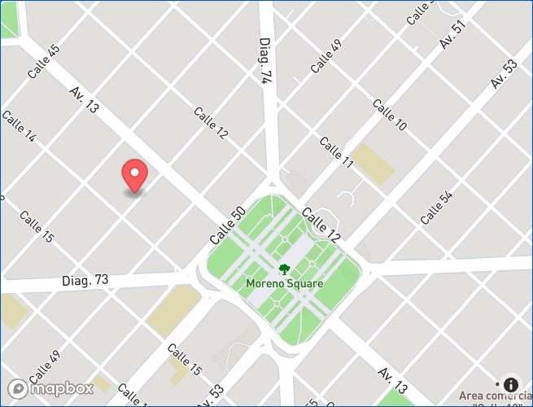

## Ingeniería de Software 2022
Laboratorio 6 - APIs externas y puntos geográficos

==


==

## APIs externas

--

Nuestras aplicaciones no pueden resolver todos los problemas que se presentan.

Podemos buscar servicios externos que resuelvan esos problemas por nosotros.

--

Las APIs externas no son más que aplicaciones web servidas por terceros.

Nuestras aplicaciones se puden autenticar contra ellas—depende de la API—y consumirlas a través de pedidos HTTP.

==

Supongamos que nuestra aplicación requiere enviar emails de comunicación a nuestros usuarios de tal manera que los usuarios no podrían usar la aplicación de no ser por los emails que le enviamos.

Necesitamos verificar que los emails que ingresan los usuarios no solamente sean válidos sino que también no sean direcciones desechables.

¿Cómo lo hacemos?

--

Usamos una API externa. Para esta explicación usaremos https://www.abstractapi.com/api/email-verification-validation-api

==

La mayoría de las APIs externas requieren autenticación. Por ende el primer paso es crear una cuenta para poder usar su servicio.

[Crear una cuenta](https://app.abstractapi.com/users/signup?target=/api/email-validation/pricing/select)


--

Me guardo la API key en las credenciales de Rails.

La API key funciona como una contraseña e indentificador que le permite a AbstractAPI asociar el pedido con mi cuenta.


--

Las credenciales de Rails es un archivo encriptado que permite guardar credenciales privadas y commitear el archivo encriptado con git.

[Más sobre las credenciales de Rails](https://guides.rubyonrails.org/security.html#environmental-security)

```bash
rails credentials:edit
```

```
secret_key_base: 3b7cd72...
abstractapi_api_key: ddff47...
```

--

Las APIs se consumen a través de pedidos HTTP. Nuestra aplicación envía un pedido y la API externa la recibe y nos responde con la información pertinente.

¿Cómo le enviamos pedidos HTTP a la API externa?

==

Podemos usar la librería provista por la standard library de Ruby, o podemos elegir otra librería. [https://www.ruby-toolbox.com/categories/http_clients](https://www.ruby-toolbox.com/categories/http_clients).

Usaremos [httparty](https://github.com/jnunemaker/httparty/tree/master/docs)

--

Primera paso es instalar la gema

```ruby
# Gemfile

gem "httparty"
```

```bash
bundle install
```

--

Creamos una clase para interactuar con la API de AbstractAPI.

```ruby
# app/models/email_validator.rb

class EmailValidator
end
```

--

El constructor deberá recibir un email para validar.

```ruby [2-4]
class EmailValidator
  def initialize(email)
    @email = email
  end
end

--

Incluyamos HTTParty y configuremos la URI base.

```ruby [2-4]
class EmailValidator
  include HTTParty

  base_uri "https://emailvalidation.abstractapi.com/v1/"

  def initialize(email)
    @email = email
  end
end
```

--

Escribamos el método que envía el pedido y realiza la validación. Recordemos que queremos validar que el email sea válido y no desechable.

```ruby [10|11-16|18]
class EmailValidator
  include HTTParty

  base_uri "https://emailvalidation.abstractapi.com/v1/"

  def initialize(email)
    @email = email
  end

  def valid?
    response = self.class.get("/", {
      query: {
        api_key: Rails.application
          .credentials
          .abstractapi_api_key,
        email: @email
      }
    })

    response["is_valid_format"]["value"] &&
      !response["is_disposable_email"]["value"]
  end
end
```

--

Y finalmente lo agregamos como una validación en nuestro modelo.

```ruby
# app/models/user.rb

class User < ApplicationRecord
  validate :email_must_be_valid_and_not_disposable

  def email_must_be_valid_and_not_disposable
    if EmailValidator.new(email).valid?
      return
    else
      errors.add(:email, :invalid)
    end
  end
end

--

Para probarlo podemos abrir una consola de Rails e intentar validar una instancia de nuestro modelo o usar directamente el validador que creamos.

```ruby
EmailValidator.new("valid@gmail.com").valid?
#=> true
EmailValidator.new("yeimunnodducei-4596@yopmail.com").valid?
#=> false
```

==

<section data-background-image="../assets/mapa.jpg">

<h2 style="filter: drop-shadow(2px 4px 6px black)">Puntos geográficos</h2>

</section>

==

¿Qué información determina un punto geográfico?

**Latitud y longitud.** <!-- .element class="fragment" -->

¿Dónde podemos guardar información geográfica? <!-- .element class="fragment" -->

**Base de datos** <!-- .element class="fragment" -->

¿Qué tipo de dato podemos usar para guardar la latitud y longitud en Postgres? <!-- .element class="fragment" -->

**[Point](https://www.postgresql.org/docs/current/datatype-geometric.html#id-1.5.7.16.5)** <!-- .element class="fragment" -->

--

Queremos guardar la ubicación de cada monstruo cuando se registran.

Empezamos agregando la columna para guardar la latitud y longitud.

--

```ruby[1-7|5]
# db/migrate/TIMESTAMP_add_point_to_monsters.rb

class AddPointToMonsters < ActiveRecord::Migration[7.0]
  def change
    add_column :monsters, :location_point, :point
  end
end
```

--

Corremos la migración `rails db:migrate` abrimos la consola y probamos esta nueva columna en el modelo de monstruos.

```ruby
Monster.last.location_point
#=> nil

Monster.new(location_point: "34.123, -57.897").location_point
#=> #<struct ActiveRecord::Point x=34.123, y=-57.897>
```

--

Actualizamos nuestro controller para que pueda recibir este nuevo atributo.

```ruby[1-15|13]
# app/controllers/monsters_controller.rb

class MonstersController < ApplicationController
  # ...

  private

  def monster_params
    params.require(:monster).permit(
      :name,
      :description,
      :phone,
      :location_point
    )
end
```

--

Actualizamos nuestro formulario para que envíe la latitud y longitud.

```erb
<%%# app/views/monsters/_form.html.erb %>

<%%= form_with model: monster do |form| %>
  <%%# ... %>

  <%%= form.text_field :location_point %>
```

¿Cómo hago para enviar la ubicación del monstruo?

--

Usaremos Geolocation.getCurrentPosition del navegador.

[https://developer.mozilla.org/en-US/docs/Web/API/Geolocation/getCurrentPosition](https://developer.mozilla.org/en-US/docs/Web/API/Geolocation/getCurrentPosition)

--

Actualicemos el formulario.

```html+erb[1-10|6|7|8]
<%%# app/views/monsters/_form.html.erb %>

<%%# ... %>

<script>
  navigator.geolocation.getCurrentPosition((pos) => {
    document.querySelector("#monster_location_point").value =
      `${pos.coords.latitude},${pos.coords.longitude}`;
  });
</script>
```

--

`#monster_location_point` es el HTML ID que Rails le asigna al input de `location_point` dentro del formulario de monstruos.

Lo podemos revisar inspeccionando la página en el navegador y buscando el atributo `id` del input.

--

¿Por qué es un text field si no queremos que los monstruos actualicen su location a mano?

```erb[]
<%%# app/views/monsters/_form.html.erb %>

<%%= form_with model: monster do |form| %>
  <%%# ... %>

  <%%= form.hidden_field :location_point %>

  <%%# ... %>
```

--

Probemos. Levantamos el servidor, vamos a crear un monstruo por primera vez después de este cambio.

Vemos que el navegador nos pregunta si queremos permitirle acceso a la ubicación. Lo permitimos.

Creamos el monstruo.

Abrimos la consola de rails y corremos:

```ruby
Monster.last.location_point
#=> #<struct ActiveRecord::Point x=-34.9201271, y=-57.9631538>
```

==

## ¿Cómo podemos mostrar su ubicación en un mapa?

--

Usaremos Mapkick [https://chartkick.com/mapkick](https://chartkick.com/mapkick)

--

Primero, nos creamos una cuenta en Mapbox [https://account.mapbox.com/auth/signup/](https://account.mapbox.com/auth/signup/)

Segundo, obtenemos un access token y lo guardamos en nuestras credentials. `rails credentials:edit`

--

Tercero, agregamos las dependencias requeridas por Mapkick en nuestro layout principal:

```erb[13-18]
<!-- app/views/layouts/application.html.erb -->

<!DOCTYPE html>
<html>
  <head>
    <title>Lab6</title>
    <meta name="viewport" content="width=device-width,initial-scale=1">
    <%%= csrf_meta_tags %>
    <%%= csp_meta_tag %>

    <%%= stylesheet_link_tag "application", "data-turbo-track": "reload" %>
    <%%= javascript_include_tag "application", "data-turbo-track": "reload", defer: true %>
    <link href="https://api.tiles.mapbox.com/mapbox-gl-js/v0.45.0/mapbox-gl.css" rel="stylesheet" />
    <script src="https://api.tiles.mapbox.com/mapbox-gl-js/v0.45.0/mapbox-gl.js"></script>
    <script>
      mapboxgl.accessToken = "<%%= Rails.application.credentials.mapbox[:access_token] %>";
    </script>
    <script src="https://unpkg.com/mapkick@0.1.1/dist/mapkick.js"></script>
  </head>

  <!-- ... -->
```

--

Y ahora a dibujar el mapa:

```html+erb[5|8-14]
<%%# app/views/monsters/show.html.erb %>

<%%# ... %>

<div id="map" style="height: 400px"></div>

<script>
  new Mapkick.Map("map", [
    {
      latitude: <%%= @monster.location_point.x %>,
      longitude: <%%= @monster.location_point.y %>,
      tooltip: '<%%= @monster.name %>'
    }
  ]);
</script>
```

--



==

¿Qué pasa cuando el monstruo se mueva?

La ubicación quedará obsoleta. <!-- .element class="fragment" -->

Si quisieramos siempre saber la ubicación actual del monstruo, ¿qué podemos hacer? <!-- .element class="fragment" -->

--

Guardaremos su ubicación en la sesión.

[https://guides.rubyonrails.org/action_controller_overview.html#session](https://guides.rubyonrails.org/action_controller_overview.html#session)

--

Para ello vamos a crear una acción específica para guardar su ubicación. El navegador silenciosamente enviará la ubicación en cada visita.

--

Creemos el controlador y la acción:

```ruby[]
# app/controllers/locations_controller.rb

class LocationsController < ApplicationController
  def create
    session[:lat] = params[:lat].to_f
    session[:lng] = params[:lng].to_f
  end
end
```

--

Ahora la ruta

```ruby[]
# config/routes.rb

resources :locations, only: :create
```

--

Ahora tenemos que hacer que el navegador envíe la ubicación cuando un monstruo abra la aplicación.

```erb[]
<%%# app/views/layouts/application.html.erb %>

<%%# Al final del body %>

<%%= form_with url: locations_path, html: { id: "location-form" } do |f| %>
  <%%= f.hidden_field :lat %>
  <%%= f.hidden_field :lng %>
<%% end %>

<script>
  navigator.geolocation.getCurrentPosition((pos) => {
    document.querySelector("#lat").value = pos.coords.latitude;
    document.querySelector("#lng").value = pos.coords.longitude;
    document.querySelector("#location-form").requestSubmit();
  });
</script>
```

--

Ahora mostremos la ubicación actual del monstruo en todas las vistas

```erb
<%%# app/views/layouts/application.html.erb %>

<%%# En algún lugar del body %>

<%% if session[:lat] && session[:lng] %>
  <p>Tu ubicación:</p>
  <p><%%= session[:lat] %>, <%%= session[:lng] %></p>
<%% end %>
```

--

Pero la primera vez no veo nada, ¿por qué?

Porque la primera vez que cargué la aplicación, la ubicación todavía no estaba guardada en la sesión. <!-- .element class="fragment" -->

¿Qué puedo hacer? <!-- .element class="fragment" -->

--

Vamos a redirigir a la misma vista luego de guardar la ubicación por primera vez.

```ruby[]
# app/controllers/locations_controller.rb

class LocationsController < ApplicationController
  def create
    previous_lat = session[:lat]

    session[:lat] = params[:lat].to_f
    session[:lng] = params[:lng].to_f

    if previous_lat.nil? && session[:lat].present?
      redirect_back fallback_location: root_path
    end
  end
end
```

--

Y ahora sí, la vista será renderizada con la ubicación, incluso luego de la primera visita.

==

## ¿Cómo armo un reporte de los monstruos creados en CABA?

--

Conociendo los puntos que determinan el perímetro de CABA, puedo escribir la siguiente consulta:

[Polígonos en postgres](https://www.postgresql.org/docs/current/functions-geometry.html#:~:text=polygon%20)

[<@ contained by](https://www.postgresql.org/docs/current/functions-geometry.html#:~:text=geometric_type%20%3C%40%20geometric_type%20%E2%86%92%20boolean)

```ruby[]
@monsters = @monsters.where(
  "location_point <@ polygon(path '(-34.526471, -58.456989), (-34.55051, -58.500248), (-34.616086, -58.531834), ...')"
)
#=> Obtengo los monstruos creados dentro de CABA
```

--

Poniendo el código un poco más elegante, me guardo los puntos que arman el perímetro de CABA en una constante.

```ruby[]
CABA = [
  [-34.526471, -58.456989],
  [-34.550510, -58.500248],
  [-34.616086, -58.531834],
  [-34.654504, -58.529087],
  [-34.706170, -58.460766],
  [-34.661564, -58.422657],
  [-34.658175, -58.373219],
  [-34.626822, -58.334767],
]
```

--

```ruby[1-20|1-2|3-7|10-12|14-20]
# Itero sobre todos los puntos
path = CABA.map do |point|
  # Un punto es un arreglo de dos elementos, lat y lng
  # Los junto con una coma usando #join
  # Envuelvo el punto entre paréntesis
  # Todo en un string
  "(#{point.join(",")})"
end

# Finalmente, junto todos los strings anteriores
# con una coma entre ellos
path = path.join(",")

# En lugar de escribir el path completo en la misma
# consulta, uso interpolación de strings para
# agregar el path que armamos en el paso anterior
@monsters = @monsters.where(
  "location_point <@ polygon(path '#{path}')"
)
#=> Obtengo los monstruos creados dentro de CABA
```

==

## ¿Cómo ordeno la lista de monstruos por cercanía hacia mí?

--

Conociendo la ubicación del usuario actual podemos escribir lo siguiente:

[<-> distancia](https://www.postgresql.org/docs/current/functions-geometry.html#:~:text=Computes%20the%20distance%20between%20the%20objects)

```ruby[]
# app/controllers/monsters_controller.rb

def index
  # ...

  @monsters = @monsters.order(
    Arel.sql(
      "point(-34.531834, -58.460766) <-> location_point"
    )
  )
end
```

--

La ubicación quedó estática en el código, **¿cómo hacemos para que sea dinámica?** Cosa de que ordene por cercanía según el usuario actual.

Usaremos la ubicación actual que guardamos en la sesión en pasos anteriores. <!-- .element class="fragment" -->

--

```ruby[]
# app/controllers/monsters_controller.rb

def index
  # ...

  @monsters = @monsters.order(
    Arel.sql(
      "point(#{session[:lat]}, #{session[:lng]}) <-> location_point"
    )
  )
end
```

`@monsters` quedó ordenada por cercanía.

Notas:
Arel.sql se precisa porque Rails levanta un error al usar datos de usuario en el SQL para evitar SQL Injection.
Queda en manos del desarrollador asegurarse que los valores de lat y lng de la session sean válidos.

==

## [Práctica 🔗](https://github.com/I110IS/lab6/blob/master/README.md)

> "Googleen. Mucho." —La cátedra.
