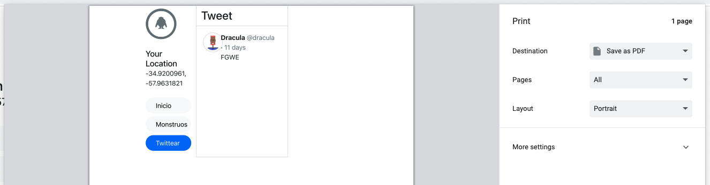
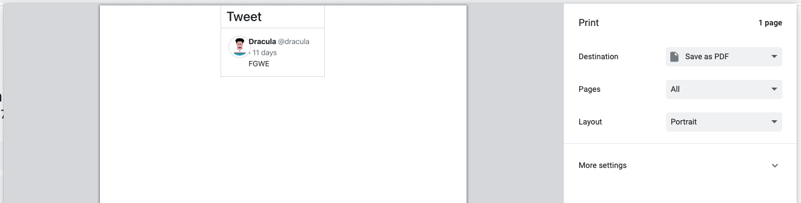

## Ingeniería de Software 2022
Laboratorio 6 - Archivos, PDFs y puntos geográficos

==

## ¿Cómo generar PDFs?

[window.print()](https://developer.mozilla.org/en-US/docs/Web/API/Window/print) nos permite abrir el diálogo para imprimir una página en el navegador.

Notas:
No lo haremos server side por que implica más trabajo y no hay mucha diferencia.

--

Usaremos una clase provista por bootstrap para especificar si algún elemento debe ser oculto al imprimir.

`.d-print-none`

[https://getbootstrap.com/docs/5.2/utilities/display/#display-in-print](https://getbootstrap.com/docs/5.2/utilities/display/#display-in-print)

--

```html
<%%# app/views/application/_left_sidebar.html.erb %>

<div class="py-2 d-print-none">
  <%%# ... %>
```

Para probar presionamos CTRL+P (para imprimir) y el left sidebar no estará presente en el preview.

--

Antes:



--

Después:



--

## ¿Cómo agregamos un botón que abra el diálogo de imprimir sin necesidad de hacer CTRL+P o Archivo+Imprimir?

--

```erb
<%%# app/views/tweets/show.html.erb

<%%# ... %>

<%%= link_to "Imprimir", "#", class: "btn", onclick: "window.print()" %>
```

==

## ¿Cómo permitir cargar archivos?

[Active Storage](https://guides.rubyonrails.org/active_storage_overview.html)

--

Primero instalemos lo necesario para usar Active Storage.

```bash
bin/rails active_storage:install
bin/rails db:migrate
```

[Setup](https://guides.rubyonrails.org/active_storage_overview.html#setup)

--

Vamos a hacer que un monstruo pueda cargar fotos a su tweet.

Como queremos que haya muchas fotos para un tweet, usaremos `has_many_attached`

[has_many_attached](https://guides.rubyonrails.org/active_storage_overview.html#has-many-attached)

--

```ruby[]
# app/models/tweet.rb

class Tweet < ApplicationRecord
  # ...

  has_many_attached :images
end
```

--

```ruby[1-20|17]
# app/controllers/tweets_controller.rb

class TweetsController < ApplicationController
  # ...

  def create
    tweet = Tweet.create!(tweet_params)
    redirect_to tweet
  end

  private

  def tweet_params
    params.require(:tweet).permit(
      :content,
      :monster_id,
      images: []
    )
  end
end
```

--

```erb[]
<%%# app/views/tweets/_form.html.erb %>

<%%= form_with model: tweet do |f| %>
  <%%# ... %>

  <%%= form.file_field :images, multiple: true %>
```

--

```erb[]
<%%# app/views/tweets/_tweet.html.erb %>

<%%# ... %>

<%% tweet.images.each do |image| %>
  <%%= image_tag image, class: "img-thumbnail" %>
<%% end %>
```

Así como usamos `.img-thumbnail`, Bootstrap tiene más clases [https://getbootstrap.com/docs/5.2/content/images/#responsive-images](https://getbootstrap.com/docs/5.2/content/images/#responsive-images).

==

## Puntos geográficos

TODO
