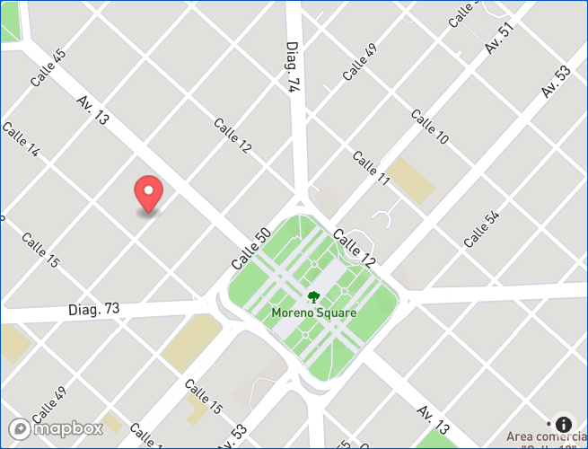

## Ingeniería de Software 2022
Laboratorio 6 - Archivos, PDFs y puntos geográficos

==

## ¿Cómo generar PDFs?

[window.print()](https://developer.mozilla.org/en-US/docs/Web/API/Window/print) nos permite abrir el diálogo para imprimir una página en el navegador.

Notas:
No lo haremos server side por que implica más trabajo y no hay mucha diferencia.

--

Usaremos una clase provista por bootstrap para especificar si algún elemento debe ser oculto al imprimir.

`.d-print-none`

[https://getbootstrap.com/docs/5.2/utilities/display/#display-in-print](https://getbootstrap.com/docs/5.2/utilities/display/#display-in-print)

--

```html
<%%# app/views/application/_left_sidebar.html.erb %>

<div class="py-2 d-print-none">
  <%%# ... %>
```

Para probar presionamos CTRL+P (para imprimir) y el left sidebar no estará presente en el preview.

--

Antes:


--

Después:


--

¿Cómo agregamos un botón que abra el diálogo de imprimir sin necesidad de hacer CTRL+P o Archivo+Imprimir?

--

```erb[1-8|8]
<%%# app/views/tweets/show.html.erb

<%%# ... %>

<%%= link_to "Imprimir",
  "#",
  class: "btn",
  onclick: "window.print()" %>
```

==

## ¿Cómo permitir cargar archivos?

[Active Storage](https://guides.rubyonrails.org/active_storage_overview.html)

--

Primero instalemos lo necesario para usar Active Storage.

```bash
bin/rails active_storage:install
bin/rails db:migrate
```

[Setup](https://guides.rubyonrails.org/active_storage_overview.html#setup)

--

Vamos a hacer que un monstruo pueda cargar fotos a su tweet.

Como queremos que haya muchas fotos para un tweet, usaremos `has_many_attached`

[has_many_attached](https://guides.rubyonrails.org/active_storage_overview.html#has-many-attached)

--

```ruby[]
# app/models/tweet.rb

class Tweet < ApplicationRecord
  # ...

  has_many_attached :images
end
```

--

```ruby[1-20|17]
# app/controllers/tweets_controller.rb

class TweetsController < ApplicationController
  # ...

  def create
    tweet = Tweet.create!(tweet_params)
    redirect_to tweet
  end

  private

  def tweet_params
    params.require(:tweet).permit(
      :content,
      :monster_id,
      images: []
    )
  end
end
```

--

```erb[]
<%%# app/views/tweets/_form.html.erb %>

<%%= form_with model: tweet do |f| %>
  <%%# ... %>

  <%%= form.file_field :images, multiple: true %>
```

--

```erb[]
<%%# app/views/tweets/_tweet.html.erb %>

<%%# ... %>

<%% tweet.images.each do |image| %>
  <%%= image_tag image, class: "img-thumbnail" %>
<%% end %>
```

Así como usamos `.img-thumbnail`, Bootstrap tiene más clases [https://getbootstrap.com/docs/5.2/content/images/#responsive-images](https://getbootstrap.com/docs/5.2/content/images/#responsive-images).

==

<section data-background-image="../assets/mapa.jpg">

<h2 style="filter: drop-shadow(2px 4px 6px black)">Puntos geográficos</h2>

</section>

==

¿Qué información determina un punto geográfico?

**Latitud y longitud.** <!-- .element class="fragment" -->

¿Dónde podemos guardamos información geográfica? <!-- .element class="fragment" -->

**Base de datos** <!-- .element class="fragment" -->

¿Qué tipo de dato podemos usar para guardar la latitud y longitud en Postgres? <!-- .element class="fragment" -->

**[Point](https://www.postgresql.org/docs/current/datatype-geometric.html#id-1.5.7.16.5)** <!-- .element class="fragment" -->

--

Queremos guardar la ubicación de cada monstruo cuando se registran.

Empezamos agregando la columna para guardar la latitud y longitud.

--

```ruby[1-7|5]
# db/migrate/TIMESTAMP_add_point_to_monsters.rb

class AddPointToMonsters < ActiveRecord::Migration[7.0]
  def change
    add_column :monsters, :location_point, :point
  end
end
```

--

Corremos la migración `rails db:migrate` abrimos la consola y probamos esta nueva columna en el modelo de monstruos.

```ruby
Monster.last.location_point
#=> nil

Monster.new(location_point: "34.123, -57.897").location_point
#=> #<struct ActiveRecord::Point x=34.123, y=-57.897>
```

--

Actualizamos nuestro controller para que pueda recibir este nuevo atributo.

```ruby[1-15|13]
# app/controllers/monsters_controller.rb

class MonstersController < ApplicationController
  # ...

  private

  def monster_params
    params.require(:monster).permit(
      :name,
      :description,
      :phone,
      :location_point
    )
end
```

--

Actualizamos nuestro formulario para que envíe la latitud y longitud.

```erb
<%%# app/views/monsters/_form.html.erb %>

<%%= form_with model: monster do |form| %>
  <%%# ... %>

  <%%= form.text_field :location_point %>
```

¿Cómo hago para enviar la ubicación del monstruo?

--

Usaremos Geolocation.getCurrentPosition del navegador.

[https://developer.mozilla.org/en-US/docs/Web/API/Geolocation/getCurrentPosition](https://developer.mozilla.org/en-US/docs/Web/API/Geolocation/getCurrentPosition)

--

Actualicemos el formulario.

```html+erb[1-10|6|7|8]
<%%# app/views/monsters/_form.html.erb %>

<%%# ... %>

<script>
  navigator.geolocation.getCurrentPosition((pos) => {
    document.querySelector("#monster_location_point").value =
      `${pos.coords.latitude},${pos.coords.longitude}`;
  });
</script>
```

--

`#monster_location_point` es el HTML ID que Rails le asigna al input de `location_point` dentro del formulario de monstruos.

Lo podemos revisar inspeccionando la página en el navegador y buscando el atributo `id` del input.

--

¿Por qué es un text field si no queremos que los monstruos actualicen su location a mano?

```erb[]
<%%# app/views/monsters/_form.html.erb %>

<%%= form_with model: monster do |form| %>
  <%%# ... %>

  <%%= form.hidden_field :location_point %>

  <%%# ... %>
```

--

Probemos. Levantamos el servidor, vamos a crear un monstruo por primera vez después de este cambio.

Vemos que el navegador nos pregunta si queremos permitirle acceso a la ubicación. Lo permitimos.

Creamos el monstruo.

Abrimos la consola de rails y corremos:

```ruby
Monster.last.location_point
#=> #<struct ActiveRecord::Point x=-34.9201271, y=-57.9631538>
```

==

## ¿Cómo podemos mostrar su ubicación en un mapa?

--

Usaremos Mapkick [https://chartkick.com/mapkick](https://chartkick.com/mapkick)

--

Primero, nos creamos una cuenta en Mapbox [https://account.mapbox.com/auth/signup/](https://account.mapbox.com/auth/signup/)

Segundo, obtenemos un access token y lo guardamos en nuestras credentials. `rails credentials:edit`

--

Tercero, agregamos las dependencias requeridas por Mapkick en nuestro layout principal:

```erb[13-18]
<!-- app/views/layouts/application.html.erb -->

<!DOCTYPE html>
<html>
  <head>
    <title>Lab6</title>
    <meta name="viewport" content="width=device-width,initial-scale=1">
    <%%= csrf_meta_tags %>
    <%%= csp_meta_tag %>

    <%%= stylesheet_link_tag "application", "data-turbo-track": "reload" %>
    <%%= javascript_include_tag "application", "data-turbo-track": "reload", defer: true %>
    <link href="https://api.tiles.mapbox.com/mapbox-gl-js/v0.45.0/mapbox-gl.css" rel="stylesheet" />
    <script src="https://api.tiles.mapbox.com/mapbox-gl-js/v0.45.0/mapbox-gl.js"></script>
    <script>
      mapboxgl.accessToken = "<%%= Rails.application.credentials.mapbox[:access_token] %>";
    </script>
    <script src="https://unpkg.com/mapkick@0.1.1/dist/mapkick.js"></script>
  </head>

  <!-- ... -->
```

--

Y ahora a dibujar el mapa:

```html+erb[5|8-14]
<%%# app/views/monsters/show.html.erb %>

<%%# ... %>

<div id="map" style="height: 400px"></div>

<script>
  new Mapkick.Map("map", [
    {
      latitude: <%%= @monster.location_point.x %>,
      longitude: <%%= @monster.location_point.y %>,
      tooltip: '<%%= @monster.name %>'
    }
  ]);
</script>
```

--



==

¿Qué pasa cuando el monstruo se mueva?

La ubicación quedará obsoleta. <!-- .element class="fragment" -->

Si quisieramos siempre saber la ubicación actual del monstruo, ¿qué podemos hacer? <!-- .element class="fragment" -->

--

Guardaremos su ubicación en la sesión.

[https://guides.rubyonrails.org/action_controller_overview.html#session](https://guides.rubyonrails.org/action_controller_overview.html#session)

--

Para ello vamos a crear una acción específica para guardar su ubicación. El navegador silenciosamente enviará la ubicación en cada visita.

--

Creemos el controlador y la acción:

```ruby[]
# app/controllers/locations_controller.rb

class LocationsController < ApplicationController
  def create
    session[:lat] = params[:lat].to_f
    session[:lng] = params[:lng].to_f
  end
end
```

--

Ahora la ruta

```ruby[]
# config/routes.rb

resources :locations, only: :create
```

--

Ahora tenemos que hacer que el navegador envíe la ubicación cuando un monstruo abre la aplicación.

```erb[]
<%%# app/views/layouts/application.html.erb %>

<%%# Al final del body %>

<%%= form_with url: locations_path, html: { id: "location-form" } do |f| %>
  <%%= f.hidden_field :lat %>
  <%%= f.hidden_field :lng %>
<%% end %>

<script>
  navigator.geolocation.getCurrentPosition((pos) => {
    document.querySelector("#lat").value = pos.coords.latitude;
    document.querySelector("#lng").value = pos.coords.longitude;
    document.querySelector("#location-form").requestSubmit();
  });
</script>
```

--

Ahora mostremos la ubicación actual del monstruo en todas las vistas

```erb
<%%# app/views/layouts/application.html.erb %>

<%%# En algún lugar del body %>

<%% if session[:lat] && session[:lng] %>
  <p>Tu ubicación:</p>
  <p><%%= session[:lat] %>, <%%= session[:lng] %></p>
<%% end %>
```

--

Pero la primera vez no veo nada, ¿por qué?

Porque la primera vez que cargué la aplicación, la ubicación todavía no estaba guardada en la sesión. <!-- .element class="fragment" -->

¿Qué puedo hacer? <!-- .element class="fragment" -->

--

Vamos a redirigir a la misma vista luego de guardar la ubicación por primera vez.

```ruby[]
# app/controllers/locations_controller.rb

class LocationsController < ApplicationController
  def create
    previous_lat = session[:lat]

    session[:lat] = params[:lat].to_f
    session[:lng] = params[:lng].to_f

    if previous_lat.nil? && session[:lat].present?
      redirect_back fallback_location: root_path
    end
  end
end
```

--

Y ahora sí, la vista será renderizada con la ubicación, incluso luego de la primera visita.

==

## ¿Cómo armo un reporte de los monstruos creados en CABA?

--

Me defino una colección de puntos que determinen el perímetro de CABA.

```ruby[]
CABA = [
  [-34.526471, -58.456989],
  [-34.550510, -58.500248],
  [-34.616086, -58.531834],
  [-34.654504, -58.529087],
  [-34.706170, -58.460766],
  [-34.661564, -58.422657],
  [-34.658175, -58.373219],
  [-34.626822, -58.334767],
]
```

--

[Polígonos en postgres](https://www.postgresql.org/docs/current/functions-geometry.html#:~:text=polygon%20)

[<@ contained by](https://www.postgresql.org/docs/current/functions-geometry.html#:~:text=geometric_type%20%3C%40%20geometric_type%20%E2%86%92%20boolean)

```ruby[]
path = CABA.map do |point|
  "(#{point.join(",")})"
end.join(",")

@monsters = @monsters.where("location_point <@ polygon(path '#{path}')")
#=> Obtengo los monstruos creados dentro de CABA
```

==

## ¿Cómo ordeno la lista de monstruos por cercanía hacia mí?

--

Usaremos la ubicación actual que guardamos en la sesión.

[<-> distancia](https://www.postgresql.org/docs/current/functions-geometry.html#:~:text=Computes%20the%20distance%20between%20the%20objects)

```ruby[]
# app/controllers/monsters_controller.rb

def index
  # ...

  @monsters = @monsters.order(
    Arel.sql(
      "point(#{session[:lat]}, #{session[:lng]}) <-> geo_point"
    )
  )
end
```

`@monsters` quedó ordenada por cercanía.

Notas:
Arel.sql se precisa porque Rails levanta un error al usar datos de usuario en el SQL para evitar SQL Injection.
Queda en manos del desarrollador asegurarse que los valores de lat y lng de la session sean válidos.

==

## [Práctica 🔗](https://github.com/I110IS/lab6/blob/master/README.md)

> "Googleen. Mucho." —La cátedra.
